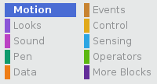

Om de coördinaten van een sprite zo in te stellen dat deze op een bepaalde locatie in het speelveld verschijnt, volg je de onderstaande stappen.

- Click on the **Motion** menu in the **Scripts** palette.
    
    

- Find the `go to x: ( ) y: ( )`{:class="blockmotion"} block.
    
    

- Typ in de `x` positie en de `y` positie waar je jouw sprite naartoe wilt laten gaan.
    
    

- Als je alleen de positie `x` of `y` in wilt stellen, kunt je in plaats daarvan één van de volgende twee blokken gebruiken.
    
     