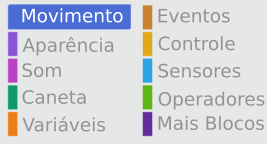

Para definir as coordenadas de um personagem e ele apareça em um determinado local do palco, siga os passos abaixo.

- Clique no menu **Movimento** da **Paleta de Blocos de Código**.
    
    

- Find the `go to x: ( ) y: ( )`{:class="blockmotion"} block.
    
    

- Digite os valores da posição `x` e da posição `y` que você deseja que seu personagem vá.
    
    

- Caso você queira preencher apenas os valores da posição `x` ou da posição `y`, você pode usar um dos dois blocos a seguir.
    
     