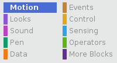

Bir kuklanın Sahne Alanı'ndaki konumunu, belirli bir yerde görünecek şekilde ayarlamak için aşağıdaki adımları izleyin.

- Click on the **Motion** menu in the **Scripts** palette.
    
    

- Find the `go to x: ( ) y: ( )`{:class="blockmotion"} block.
    
    

- Kuklanızın gitmesini istediğiniz `x` konumunu ve `y` konumunu yazın.
    
    

- Yalnızca `x` veya `y` konumunu ayarlamak istiyorsanız, bunun yerine aşağıdaki iki bloktan birini kullanabilirsiniz.
    
     